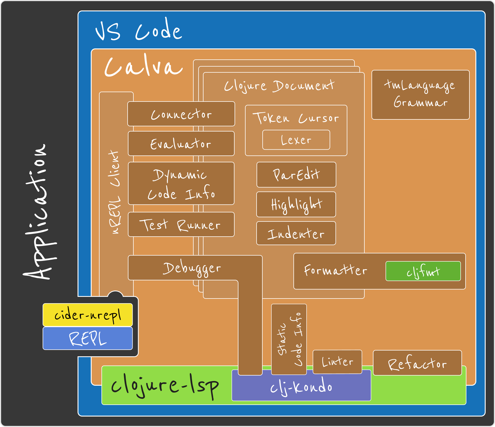

# 

  

Released March 16 2018  🎉

## My favorites: VS Code and Clojure

* Actively developed
  * Peter Strömberg
  * Brandon Ringe
* **Interactive programming**
  * Connects the editor to the running application's REPL 
  * Custom REPL-commands
* **Structural editing** {([(((♥️)))])}
* **Getting Started REPL**   https://calva.io/getting-started
  * Unique for Calva 
* Syntax highlight
  * Rainbow 🌈 brackets and vertical guides
  * Structural comments
* Formatting
* Pretty printing
* Code documentation and navigation
  * Including libraries
  * Including Java
* Debugger
* Test runner
* Linter
* Refactoring

  

  

    
  

---

[Start](hello.md) > [Clojure](clojure.md) > [REPL](repl.md) > [Calva](calva.md) > [ClojureScript](cljsrn.md) > [Further](moar.md)