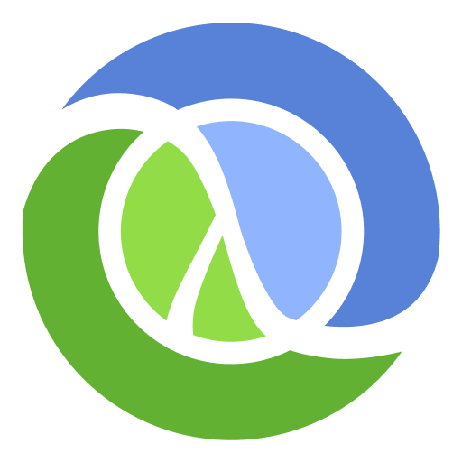

# Clojure

## The Worlds Most Ergonomic Programming Language?

* Practical and Pragmatic 
* Hosted Language
    * JVM
    * JavaScript VM
    * CLR
* Interactive Programming
    * REPL connected inside the running program under development
    * Dynamic – modify the running program
* Data Oriented
* Functional First
* Immutable by default
    * Value Semantics
    * Thread Safety
* Sequence Abstraction
    * Lazyness
* Rich Data Types
* Rich Standard Library (Clojure Core)
    * Stable API:s 
* Grows through Libraries
    * Do one thing – do it well
    * Framework aversion
    * Stable API:s (cultural heritage)
* Structural Code
    * Code is data/homoiconicity
    * ”Real” macros

Active development. Engagaged++ community, supported by the creators of Clojure (Cognitect)

---

[Start](hello.md) > [Clojure](clojure.md) > [Calva](calva.md) > [ClojureScript](cljsrn.md) > [Moar?](moar.md)