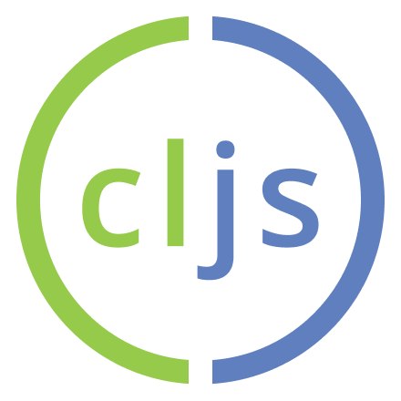

# Wexio Lambda Sessions May 6 2021

Peter Strömberg - https://github.com/PEZ
* 4Food: Hacking health at Pilloxa: Mobile app using React Native and ClojureScript
* 4Fun: Family and coding

## Agenda

Theme: _Developer Ergonomics_

* Clojure
* Calva, a VS Code Extension
* AMA
* (Mobile App Development with ClojureScript)

  

    
    
    
  

https://github.com/PEZ/wexio-lambda-sessions

---

[Start](hello.md) > [Clojure](clojure.md) > [Calva](calva.md) > [ClojureScript](cljsrn.md) > [Moar?](moar.md)